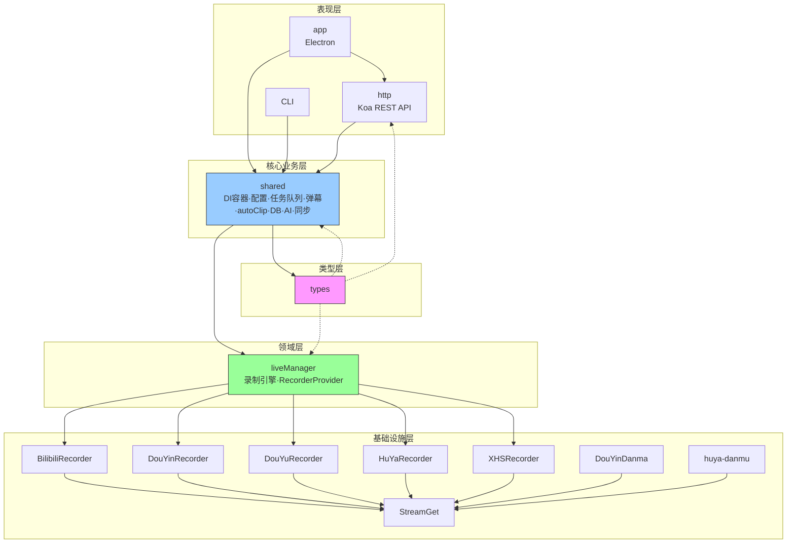

# ARCHITECTURE.md — biliLive-tools

> 生成：2026-06-05 · 首次建立
> 依据：CONTEXT.md + 代码结构扫描 + 已归档 change 的 DESIGN §9

## 1. 架构概述

biliLive-tools 是一个**直播一站式工具**的 pnpm monorepo，14 个包协同工作。核心能力：多平台直播录制、弹幕处理、视频切片/上传、webhook 自动化。

### 架构原则

1. **DI 驱动组装**：awilix 容器作为唯一组合根，各模块通过 DI 解耦
2. **平台适配器模式**：5 个平台 recorder 实现统一 `RecorderProvider` 接口
3. **Pipeline 模式**：autoClip 采用多阶段管道（信号检测→LLM 排序→边界精修→导出）
4. **简单胜过抽象**：TypeScript ESM，无 ORM（直接 SQL），同步 SQLite（better-sqlite3）

---

## 2. 模块分层

```
┌─────────────────────────────────────────┐
│ 表现层                                   │
│  app (Electron) · CLI · http (Koa REST) │
├─────────────────────────────────────────┤
│ 核心业务层                                │
│  shared (DI容器 · 配置 · 任务队列 ·       │
│         弹幕 · autoClip · DB · AI · 同步) │
├─────────────────────────────────────────┤
│ 领域层                                    │
│  liveManager (录制引擎 · RecorderProvider)│
├─────────────────────────────────────────┤
│ 基础设施层                                 │
│  BilibiliRecorder · DouYinRecorder ·      │
│  DouYuRecorder · HuYaRecorder ·           │
│  XHSRecorder · DouYinDanma · huya-danmu   │
│  StreamGet (流解析)                        │
├─────────────────────────────────────────┤
│ 类型层                                     │
│  types (共享 TypeScript 类型)              │
└─────────────────────────────────────────┘
```

---

## 3. 模块依赖图



**依赖方向**：严格自顶向下（表现→核心→领域→基础设施），无循环依赖。

**关键依赖**：

- `app` → `http` (前端通过 REST API 调用)
- `http` → `shared` (API 层通过 DI 容器获取服务)
- `shared` → `liveManager` (录制管理通过 RecorderManager 接口)
- `liveManager` → 各平台 recorder (通过 RecorderProvider 接口)

---

## 4. ADR — 架构决策记录

### ADR-1: awilix DI 容器

**决策**：使用 awilix 作为 DI 容器，`init()` 函数创建容器并注册所有服务单例。

**上下文**：200+ 源文件 monorepo，需要解耦配置/任务队列/预设/录制器/数据库等核心服务。

**后果**：

- ✅ 服务生命周期统一管理，测试时可替换 mock
- ✅ 避免全局单例污染
- ⚠️ `packages/http/src/routes/autoClip.ts` 直接 import container（DI 容器泄漏到路由层），待修复

### ADR-2: RecorderProvider 抽象

**决策**：定义 `RecorderProvider` 接口（`packages/liveManager/src/index.ts`），各平台实现此接口。

**上下文**：需支持 5 个直播平台（B站/抖音/斗鱼/虎牙/小红书），统一录制调度。

**后果**：

- ✅ 新增平台只需实现 `RecorderProvider` 接口 + 注册到 `createRecorderManager`
- ✅ 平台特有逻辑封装在各自包内，不影响核心引擎
- ⚠️ 接口需保持向后兼容——5 个 recorder 同时依赖

### ADR-3: better-sqlite3 同步 SQLite

**决策**：使用 better-sqlite3（同步）而非异步 ORM。

**上下文**：Electron 桌面应用，数据量小（录制元数据、弹幕、切片结果），不需高并发。

**后果**：

- ✅ 简单直接，无连接池管理
- ✅ 适合 Electron 单用户场景
- ⚠️ 原生模块需针对 Node 版本编译（健康巡检已修复）
- ⚠️ 类型安全靠手写 SQL + TypeScript 接口

### ADR-4: autoClip Pipeline 模式

**决策**：autoClip 采用多阶段管道（`runAutoClipPipeline`）。

**上下文**：自动切片需经过"弹幕解析→信号检测→LLM 排序→边界精修→导出"多个步骤。

**后果**：

- ✅ 每个阶段独立可测试（`signalDetector`、`llmRanker`、`boundaryRefiner` 各有测试）
- ✅ 阶段可通过配置跳过（如关闭 LLM 时用启发式排序）
- ✅ 证据链（Evidence）贯穿全管道，可追溯决策
- ✅ 证据存储使用 SQLite TEXT 列（JSON），前端用 Canvas API 自绘密度图
- ⚠️ 大文件模块需拆分（`exportPipeline.ts` 566行、`signalDetector.ts` 591行）

### ADR-5: 弹幕过滤器规则引擎

**决策**：弹幕过滤支持 exact/contains/regex 三种模式，运行时编译规则。

**上下文**：直播弹幕含大量噪声（表情、重复、刷屏），需可配置过滤规则。

**后果**：

- ✅ 用户可自定义过滤规则
- ✅ 内置 ReDoS 防护（拒绝嵌套量词、超长模式截断）
- ⚠️ 正则模式无超时机制——长文本+复杂正则可能阻塞事件循环

---

## 5. 跨模块契约

### 5.1 RecorderProvider 接口

```typescript
// packages/liveManager/src/index.ts (抽象契约)
interface RecorderProvider {
  // 平台标识
  readonly platform: string;
  // 获取直播流 URL
  resolveStream(url: string): Promise<StreamInfo>;
  // 下载流媒体
  download(streamInfo: StreamInfo, outputPath: string, signal?: AbortSignal): Promise<void>;
  // 检查直播状态
  checkLiveStatus(url: string): Promise<LiveStatus>;
}
```

**实现方**：5 个平台 recorder 包（BilibiliRecorder / DouYinRecorder / DouYuRecorder / HuYaRecorder / XHSRecorder）

**变更门槛**：接口变更需同步更新全部 5 个实现 + liveManager。属**破坏性变更**，走 0-change 二次拦截。

### 5.2 DI 容器契约

```typescript
// packages/shared/src/index.ts
function init(config: GlobalConfig): AwilixContainer<{
  appConfig: AppConfig;
  taskQueue: TaskQueue;
  recorderManager: RecorderManager;
  danmuPreset: DanmuPreset;
  videoPreset: VideoPreset;
  ffmpegPreset: FFmpegPreset;
  subtitleStylePreset: SubtitleStylePreset;
  autoClipPreset: AutoClipPreset;
  autoClipService: AutoClipService;
  // ... 更多注册项
}>;
```

**消费者**：

- `packages/http/src/index.ts` — `serverStart(container)` 接收容器，注册路由
- `packages/app/src/main/index.ts` — 调用 `init()` + `serverStart()`

### 5.3 autoClip Pipeline 接口

```typescript
// packages/shared/src/autoClip/pipeline.ts
interface PipelineParams {
  videoPath: string;
  danmuPath: string;
  presetConfig: AutoClipConfig;
  sendMessage?: SendMessageFn;
  sendBoundaryRefineMessage?: SendMessageFn;
  sendMultimodalMessage?: SendMultimodalMessageFn;
  recognizeASR?: RecognizeASRFn;
  ffmpegPath?: string;
  signal?: AbortSignal;
}

async function runAutoClipPipeline(params: PipelineParams): Promise<AutoClipResult>;
```

### 5.4 HTTP API 约定

- **认证**：passkey 中间件（`packages/http/src/middleware/`）
- **路由前缀**：`/api/` + 资源名（config / recorder / task / bili / video / danma / sync / ai / autoClip）
- **错误格式**：`{ error: string }` 或全局错误中间件拦截
- **SSE**：进度推送使用 `koa-sse-stream`

### 5.5 外部二进制接口

| 二进制               | 接口约定                         | 配置路径                       |
| -------------------- | -------------------------------- | ------------------------------ |
| FFmpeg               | 命令行调用，参数通过预设模板生成 | `AppConfig.ffmpegPath`         |
| FFprobe              | 同上，用于视频元数据提取         | 同上                           |
| DanmakuFactory       | 弹幕压制，XML→ASS 转换           | `AppConfig.danmakuFactoryPath` |
| mesio                | 流媒体录制引擎                   | AppConfig 中配置               |
| BililiveRecorder CLI | 备用录制器（B站专用）            | AppConfig 中配置               |
| audiowaveform        | 音频波形生成                     | AppConfig 中配置               |

**变更门槛**：二进制接口变更需协调用户手动升级，属**破坏性变更**。

### 5.6 Evidence 数据契约

```typescript
// packages/shared/src/autoClip/evidence.ts
function buildEvidence(params: BuildEvidenceParams): Evidence;
function parseEvidenceSafe(raw: string | null): Evidence | null;
```

**规则**：

- Evidence 存储为 `auto_clip_results.evidence` 列的 JSON TEXT
- **禁止**在路由中裸调 `JSON.parse(evidence)`——必须走 `parseEvidenceSafe`（容错 null/损坏数据）
- 新增 pipeline 阶段的数据通过 `buildEvidence` 追加，不改 pipeline 主体

---

## 6. 热区与演进方向

### 当前热区（按近期变更频率）

| 模块                      | 变更频率                 | 风险                                |
| ------------------------- | ------------------------ | ----------------------------------- |
| `autoClip/`               | 🔴 极高（占总变更 ~40%） | 模块拆分需求（2026-06-05 巡检建议） |
| `http:routes/autoClip.ts` | 🔴 高                    | DI 容器泄漏，需解耦                 |
| `types/`                  | 🟡 中                    | 接口演化需向后兼容                  |

### 建议演进路径

1. **短期**（1-2 月）：拆分 `exportPipeline.ts`、修复 DI 泄漏
2. **中期**（3-6 月）：ESLint flat config 迁移、覆盖率提高到 70%+
3. **长期**（6-12 月）：autoClip 独立为微服务（如规模继续增长）

---

## 7. 变更影响矩阵

新增功能时，参考此矩阵评估影响面：

| 变更类型               | 影响的包                            | 额外检查                             |
| ---------------------- | ----------------------------------- | ------------------------------------ |
| 新增平台 recorder      | types + liveManager + shared + 新包 | 需实现 RecorderProvider，注册到 DI   |
| 修改 autoClip pipeline | shared + http + app                 | 检查 evidence 类型兼容性             |
| 新增 HTTP 路由         | http + app (前端 API)               | passkey 认证中间件是否覆盖           |
| 修改 GlobalConfig      | types + shared + http + app         | 破坏性变更，需迁移策略               |
| 新增预设模板           | shared + app                        | preset dialog 需对应更新             |
| 外部二进制路径变更     | shared + app                        | 用户文档更新                         |
| 修改 DB schema         | shared/db                           | 需要 migration（runMigrations 模式） |

---

_架构基线建立日期：2026-06-05 · 下次审查建议：2026-09-05（或重大架构变更后）_
